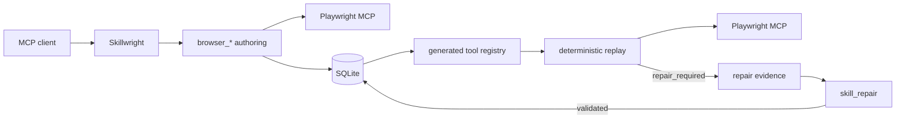

# Architecture

Skillwright is one local stdio MCP server with three main paths: authoring, generated-tool replay, and repair.

## Authoring

Each Skillwright stdio process owns one interactive browser controller. `browser_*` calls are serialized through that controller so page state, recording boundaries, and secret redaction stay coherent within the process.

Successful interactive actions are stored in browser authoring history. `skill_record_start` records a history boundary in process memory; `skill_record_stop` compiles the actions after that boundary.

The compiler converts browser actions into workflow steps such as `navigate`, `click`, `fill`, `select`, and `wait`. Snapshot calls provide target evidence but are not replay steps themselves.

## Generated MCP tools

Each persisted skill has a stable generated MCP tool name. At startup Skillwright reads current skill versions from SQLite and registers a callable for each one.

The generated callable is built from the workflow schema:

- public workflow inputs become typed MCP parameters
- required/default semantics are preserved
- secret inputs are omitted from the public schema
- declared workflow outputs become structured MCP output fields
- the callable is bound to the version whose schema it advertises

When a skill changes, the registered tool is replaced with the new current version and a standard MCP tool-list change notification is published.

## Replay

Generated-tool replay uses an execution browser separate from the interactive authoring browser. Replay does not append browser actions to authoring history.

Element targets are resolved from persisted semantic evidence rather than original Playwright snapshot refs. The workflow can store role/name information, stable attributes, nearby text, URL context, and a durable locator when available.

Composed child skills share one execution browser for the parent invocation.

## Persistence

SQLite contains four current product tables/concepts:

- browser actions
- skills
- workflow versions
- skill secret bindings

Schema initialization and version allocation use SQLite write serialization so multiple local Skillwright processes sharing a database do not race version numbers.

Skillwright recognizes and migrates older Skillwright SQLite schemas. It does not reinterpret an unrelated non-empty SQLite database as a Skillwright database.

## Secrets

Only secret references and bindings are persisted. Plaintext values are read from the environment when needed and are redacted from known browser results, snapshots, errors, and persisted action data.

## Runtime scope

Skillwright intentionally does not have a separate REST API, queue, worker service, remote database requirement, or account system. A generated MCP tool call executes its workflow in the MCP process and returns its result directly.

[Back to docs](README.md)
